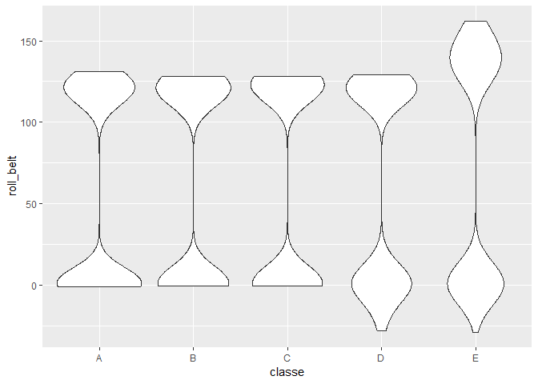
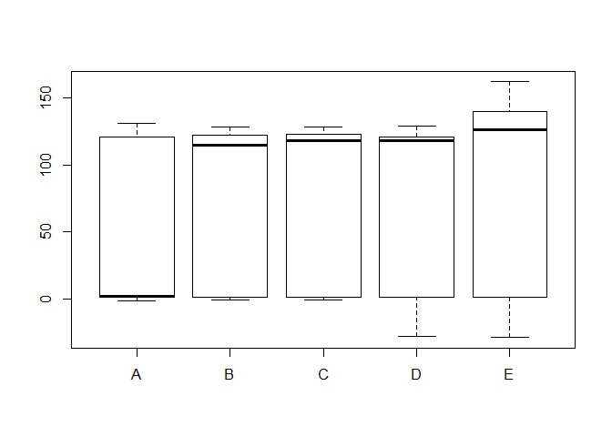
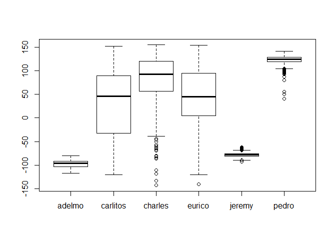

ProjectReport PracticalML
================
Nilanka Weeraman
November 8, 2018

Import and examine dataset

``` r
training <- read.csv("D:\\D\\F_BACKUP\\Coursera\\Axiata\\Practical ML\\pml-training.csv")
testing <- read.csv("D:\\D\\F_BACKUP\\Coursera\\Axiata\\Practical ML\\pml-testing.csv")

names(training)
```

    ##   [1] "X"                        "user_name"               
    ##   [3] "raw_timestamp_part_1"     "raw_timestamp_part_2"    
    ##   [5] "cvtd_timestamp"           "new_window"              
    ##   [7] "num_window"               "roll_belt"               
    ##   [9] "pitch_belt"               "yaw_belt"                
    ##  [11] "total_accel_belt"         "kurtosis_roll_belt"      
    ##  [13] "kurtosis_picth_belt"      "kurtosis_yaw_belt"       
    ##  [15] "skewness_roll_belt"       "skewness_roll_belt.1"    
    ##  [17] "skewness_yaw_belt"        "max_roll_belt"           
    ##  [19] "max_picth_belt"           "max_yaw_belt"            
    ##  [21] "min_roll_belt"            "min_pitch_belt"          
    ##  [23] "min_yaw_belt"             "amplitude_roll_belt"     
    ##  [25] "amplitude_pitch_belt"     "amplitude_yaw_belt"      
    ##  [27] "var_total_accel_belt"     "avg_roll_belt"           
    ##  [29] "stddev_roll_belt"         "var_roll_belt"           
    ##  [31] "avg_pitch_belt"           "stddev_pitch_belt"       
    ##  [33] "var_pitch_belt"           "avg_yaw_belt"            
    ##  [35] "stddev_yaw_belt"          "var_yaw_belt"            
    ##  [37] "gyros_belt_x"             "gyros_belt_y"            
    ##  [39] "gyros_belt_z"             "accel_belt_x"            
    ##  [41] "accel_belt_y"             "accel_belt_z"            
    ##  [43] "magnet_belt_x"            "magnet_belt_y"           
    ##  [45] "magnet_belt_z"            "roll_arm"                
    ##  [47] "pitch_arm"                "yaw_arm"                 
    ##  [49] "total_accel_arm"          "var_accel_arm"           
    ##  [51] "avg_roll_arm"             "stddev_roll_arm"         
    ##  [53] "var_roll_arm"             "avg_pitch_arm"           
    ##  [55] "stddev_pitch_arm"         "var_pitch_arm"           
    ##  [57] "avg_yaw_arm"              "stddev_yaw_arm"          
    ##  [59] "var_yaw_arm"              "gyros_arm_x"             
    ##  [61] "gyros_arm_y"              "gyros_arm_z"             
    ##  [63] "accel_arm_x"              "accel_arm_y"             
    ##  [65] "accel_arm_z"              "magnet_arm_x"            
    ##  [67] "magnet_arm_y"             "magnet_arm_z"            
    ##  [69] "kurtosis_roll_arm"        "kurtosis_picth_arm"      
    ##  [71] "kurtosis_yaw_arm"         "skewness_roll_arm"       
    ##  [73] "skewness_pitch_arm"       "skewness_yaw_arm"        
    ##  [75] "max_roll_arm"             "max_picth_arm"           
    ##  [77] "max_yaw_arm"              "min_roll_arm"            
    ##  [79] "min_pitch_arm"            "min_yaw_arm"             
    ##  [81] "amplitude_roll_arm"       "amplitude_pitch_arm"     
    ##  [83] "amplitude_yaw_arm"        "roll_dumbbell"           
    ##  [85] "pitch_dumbbell"           "yaw_dumbbell"            
    ##  [87] "kurtosis_roll_dumbbell"   "kurtosis_picth_dumbbell" 
    ##  [89] "kurtosis_yaw_dumbbell"    "skewness_roll_dumbbell"  
    ##  [91] "skewness_pitch_dumbbell"  "skewness_yaw_dumbbell"   
    ##  [93] "max_roll_dumbbell"        "max_picth_dumbbell"      
    ##  [95] "max_yaw_dumbbell"         "min_roll_dumbbell"       
    ##  [97] "min_pitch_dumbbell"       "min_yaw_dumbbell"        
    ##  [99] "amplitude_roll_dumbbell"  "amplitude_pitch_dumbbell"
    ## [101] "amplitude_yaw_dumbbell"   "total_accel_dumbbell"    
    ## [103] "var_accel_dumbbell"       "avg_roll_dumbbell"       
    ## [105] "stddev_roll_dumbbell"     "var_roll_dumbbell"       
    ## [107] "avg_pitch_dumbbell"       "stddev_pitch_dumbbell"   
    ## [109] "var_pitch_dumbbell"       "avg_yaw_dumbbell"        
    ## [111] "stddev_yaw_dumbbell"      "var_yaw_dumbbell"        
    ## [113] "gyros_dumbbell_x"         "gyros_dumbbell_y"        
    ## [115] "gyros_dumbbell_z"         "accel_dumbbell_x"        
    ## [117] "accel_dumbbell_y"         "accel_dumbbell_z"        
    ## [119] "magnet_dumbbell_x"        "magnet_dumbbell_y"       
    ## [121] "magnet_dumbbell_z"        "roll_forearm"            
    ## [123] "pitch_forearm"            "yaw_forearm"             
    ## [125] "kurtosis_roll_forearm"    "kurtosis_picth_forearm"  
    ## [127] "kurtosis_yaw_forearm"     "skewness_roll_forearm"   
    ## [129] "skewness_pitch_forearm"   "skewness_yaw_forearm"    
    ## [131] "max_roll_forearm"         "max_picth_forearm"       
    ## [133] "max_yaw_forearm"          "min_roll_forearm"        
    ## [135] "min_pitch_forearm"        "min_yaw_forearm"         
    ## [137] "amplitude_roll_forearm"   "amplitude_pitch_forearm" 
    ## [139] "amplitude_yaw_forearm"    "total_accel_forearm"     
    ## [141] "var_accel_forearm"        "avg_roll_forearm"        
    ## [143] "stddev_roll_forearm"      "var_roll_forearm"        
    ## [145] "avg_pitch_forearm"        "stddev_pitch_forearm"    
    ## [147] "var_pitch_forearm"        "avg_yaw_forearm"         
    ## [149] "stddev_yaw_forearm"       "var_yaw_forearm"         
    ## [151] "gyros_forearm_x"          "gyros_forearm_y"         
    ## [153] "gyros_forearm_z"          "accel_forearm_x"         
    ## [155] "accel_forearm_y"          "accel_forearm_z"         
    ## [157] "magnet_forearm_x"         "magnet_forearm_y"        
    ## [159] "magnet_forearm_z"         "classe"

#### Observations of training and testing data

The dataset contains sensor readings of activity (dumpbell lifting) for each person. And in training data, both continuous readings (sampled) and summarized readings (after activity is finished for one rep) available. This is distinguished by **new\_window** variable. When examining testing data, it only contains new\_window='No' instances only. Thus we can ignore 'No' instances for training.

``` r
tr_no<-training[training$new_window=='no',]
```

And I'm also keeping out timestamp related attributes from training, and define my training varible list

``` r
inputs=c('user_name','roll_belt','pitch_belt','yaw_belt','total_accel_belt'
         ,'gyros_belt_x','gyros_belt_y','gyros_belt_z','accel_belt_x','accel_belt_y'
         ,'accel_belt_z','magnet_belt_x','magnet_belt_y','magnet_belt_z','roll_arm'
         ,'pitch_arm','yaw_arm','total_accel_arm','gyros_arm_x','gyros_arm_y'
         ,'gyros_arm_z','accel_arm_x','accel_arm_y','accel_arm_z','magnet_arm_x'
         ,'magnet_arm_y','magnet_arm_z','roll_dumbbell','pitch_dumbbell','yaw_dumbbell'
         ,'total_accel_dumbbell','gyros_dumbbell_x','gyros_dumbbell_y','gyros_dumbbell_z','accel_dumbbell_x'
         ,'accel_dumbbell_y','accel_dumbbell_z','magnet_dumbbell_x','magnet_dumbbell_y','magnet_dumbbell_z'
         ,'roll_forearm','pitch_forearm','yaw_forearm','total_accel_forearm'
         ,'gyros_forearm_x','gyros_forearm_y','gyros_forearm_z','accel_forearm_x','accel_forearm_y'
         ,'accel_forearm_z','magnet_forearm_x','magnet_forearm_y','magnet_forearm_z','classe')
tr_no_fil <- tr_no[,inputs]
```

#### Explore covariates

Exploring relationship between inputs and 'target'classe' by plotting distributions as; 

``` r
plot(tr_no_fil$classe,tr_no_fil$roll_belt)
```

 It is clear that Class A and E have differences in distributions for variable roll\_belt. Likewise its possible to explore few more

Even different users have different measurements for same activity type, as shown in below plot. Thus 'user\_name' can be considered as an input

``` r
plot(tr_no_fil[tr_no_fil$classe=='A',c("user_name")],tr_no_fil[tr_no_fil$classe=='A',c("yaw_dumbbell")])
```

 Since we have large no of potential input variables, we can us

Lets examine a simple classifier is able to classify events.
Using a decision tree

libray(caret)
modTree&lt;-train(classe ~., method="rpart",data=training)
require(rattle)
fancyRpartPlot(modTree$finalModel)


Thus I've decided to use Random Forest classifier for predictions
*Note - I could not include caret package into R markdown. Thus below codes are shown as R comments. Please bear with me *

#### Model Building and Evaluation

library(caret)
inTrain = createDataPartition(tr\_no$classe, p = 3/4)\[\[1\]\]
training = tr\_no\[ inTrain,\]
testing = tr\_no\[-inTrain,\]
training&lt;-training\[,inputs\]
testing&lt;-testing\[,inputs\]

metric&lt;-"Accuracy"
\#\# 10 fold cross validation to negate any overfitting by random Forest model
control &lt;- trainControl(method="repeatedcv", number=10, repeats=3, search="random")
mtry &lt;- sqrt(ncol(training))
modRF &lt;- train(classe~., data=training, method="rf",
metric=metric, tuneLength=15, trControl=control)

predRF&lt;-predict(modRF,testing)
confusionMatrix(testing$classe,predRF)

refence - <https://machinelearningmastery.com/tune-machine-learning-algorithms-in-r/>

Now we test performance on testing dataset


Both in sample and out of sample error rates are very low. Thus I have finalized above model as my final and used for the quiz.
